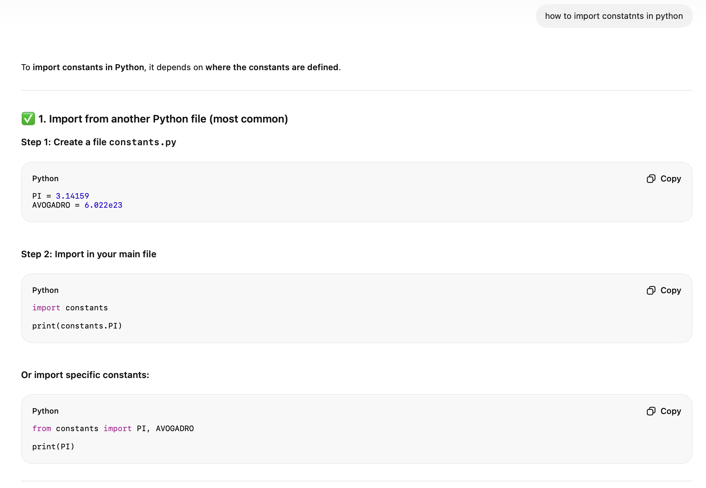
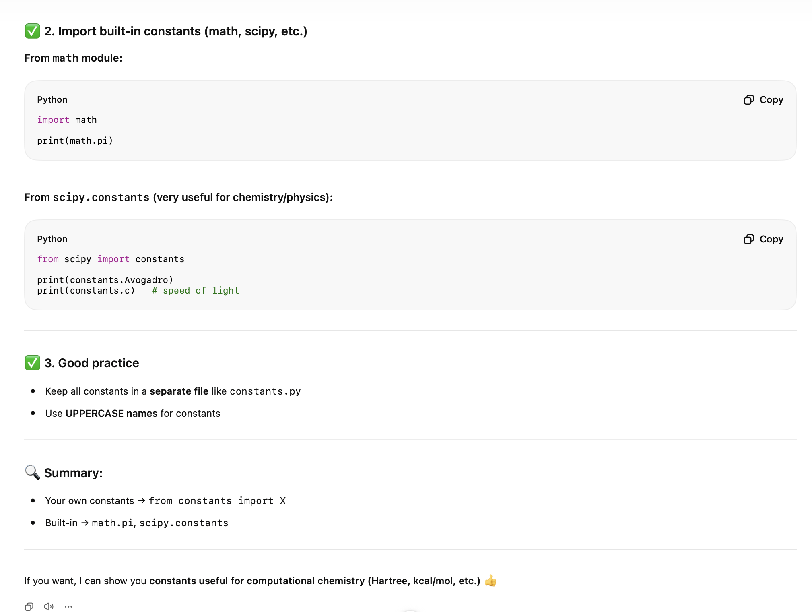
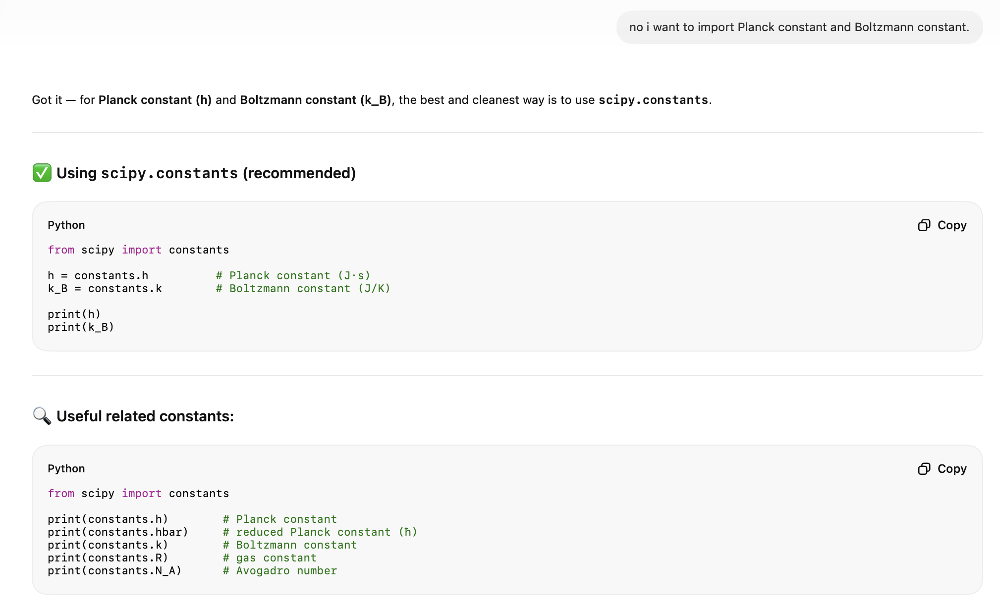

# Day 2 assignment for "Basic programming skills (Python)" course

In this assignment, a simple python code (q_trans-Aditya-Barman.py) is written in which the translatrional partition function is solved using the user inputs.
</p>

$$
q_{trans} =  [\frac{(2πmk_BT)}{h^2}]^{3/2} V
$$
</p>

Where, h = Planck constant, k<sub>B</sub> = Boltzmann constant, T = temperature, m = mass of molecule, and V = volume element.

## Importance of translatrional partition function
- The translational partition function is important because it describes how particles distribute themselves among the possible translational energy states (motion through space) in a system. It is one of the key components of the total molecular partition function in statistical mechanics.
- The translational partition function is used to calculate: Internal energy, Entropy, Helmholtz free energy, Pressure, Heat capacity, etc.
- It provides the microscopic basis for macroscopic gas laws. From the translational partition function, one can derive the ideal gas equation: PV=nRT.

## Requirements
The pyhton code to do the above mentioned calculation is encoded in the file, ```q_trans-Aditya_Barman.py``` and in that code some external libraries are used, e.g.,
- ```scipy``` to add the value of constants.
- If scipy is not present one can installed that by using the pip installer. (I am using IOS terminal to install that and aslo to run the python code). ```pip install scipy```

## Run the code
To run the code: ```python q_trans-Aditya_Barman.py```

## Usage of AI
To solve the assignment I used ChatGpt (Weizmann subscription version) only once to know how to import verious types of constants (e.g., plack's constsnt, Boltzmann constant, etc.). Here is the conversation:






